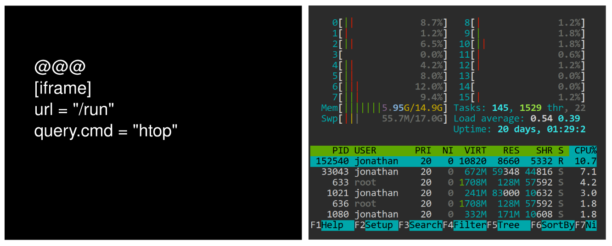

`slidie-ttyd`: Embed live terminals in your slidie presentation
===============================================================

`slidie-ttyd` is a utility which allows you to embed live terminals into your
[slidie](https://github.com/mossblaser/slidie) slide shows using
[ttyd](https://github.com/tsl0922/ttyd) under the hood.

Usage overview
--------------

Run the `slidie-ttyd` command to start a local server listening on
`http://127.0.0.1:8080`. You can optionally give the name of a slidie XHTML
presentation to server at `/`:

    $ slidie-ttyd path/to/presentation.xhtml

*NB: Serving your presentation using `slidie-ttyd` is optional but doing so
means you can use short relative URLs below.*

To create a terminal, create an [iframe magic
text](https://mossblaser.github.io/slidie/iframe.html) with the URL `/shell`
(to start a shell) or `/run` to run a predefined command. Query options are
used to specify what to run as illustrated by the following example (source on
the left, result on the right):

Warning
-------

This tool provides unauthenticated remote code execution as a service! Though
it defaults to only listening for connections on 127.0.0.1 (i.e. IPv4
localhost), beware that any other application running on the same host can
still reach it.

Reference
---------

The following sections enumerate all of the query parameters which can be used
to control the terminals and what runs in them. The API has been designed with
[Slidie's URL query parameter appending
syntax](https://mossblaser.github.io/slidie/iframe.html#appending-url-query-parameters)
in mind.

### Running commands (`/run`)

The `/run` endpoint runs a single command without a shell. The command to run
may be specified either as a single string via the `cmd` query parameter to be
parsed using Python's
[`shlex.split`](https://docs.python.org/3/library/shlex.html#shlex.split)  or
as a series of `argv` parameters, one per argument:

    @@@
    [iframe]
    url = "/run"
    
    # Either...
    query.cmd = "echo 'hello world'"
    # ... or ...
    query.argv = [
        "echo",
        "hello world",
    ]
    # (but not both!)

### Starting a shell (`/shell`)

The system's default shell is started by the `/shell` endpoint. (Setting the
`SHELL` environment variable overrides this).

You can pre-populate the shell's command history by adding `history` query
parameters, one per history entry. This can be useful if you want to prepare
commands to run during a demo, for example:

    @@@
    [iframe]
    url = "/shell"
    
    query.history = [
        "git init",
        "touch foo.txt",
        "git add foo.txt",
    ]

This feature works by creating a history file with the specified lines in it
and setting the `HISTFILE` environment variable when launching the shell.

### Setting working directory and environment

Both the `/run` and `/shell` endpoints support the `cwd` and `env` query
parameters to change the initial working directory and define environment
variables respectively:

    @@@
    [iframe]
    url = "/run"
    
    query.cmd = "foo-bar"
    
    # Run the command in the /tmp directory
    query.cwd = "/tmp"
    
    # Define the following environment variables (in addition to any already
    # set)
    query.env = [
        "FOO=bar",
        "HELLO=world",
    ]

### Running on a remote host

You can start a shell or run a command on a remote machine SSH instead by
adding the `ssh` query parameter:

    @@@
    [iframe]
    url = "/shell"
    
    query.ssh = "user@example.com"

Repeat the `ssh` parameter if you need to add additional `ssh` command
arguments.

Note: `slidie-ttyd` takes care of all the somewhat awkward escaping normally
necessary when starting a remote command using SSH. All other features will
work as normal.

### Controling terminal appearance

You can set the default terminal font and text size using the
`--font-name`/`-F` and `--font-size`/`-f` parameters to the `slidie-ttyd`
command.

You can also override the font and text size for an individual terminal using
the `font_name` and `font_size` query parameters respectively:

    @@@
    [iframe]
    url = "/run"
    query.cmd = "htop"
    
    # Use tiny text in a different monospace font!
    query.font_name = "Monaco"
    query.font_size = "12"

### Built-in web server

If a Slidie presentation filename is provided as an argument to `slidie-ttyd`,
it will be served at `/`. If none is specified, any `out.xhtml` in the current
directory will be served.

Other files in the same directory will also be served via their filenames
(except files in the top directory named `run` and `shell`, of course).

Security rules in some browsers prevent keyboard/mouse input to `<iframes>` in
some situations when served from `file://` URLs. As a result, hosting your
slides on a web server may be necessary. Further, using server built into
`slidie-ttyd` has the added benefit of permitting the use of relative URLs (as
shown in all of the examples).

Implementation details
----------------------

`slidie-ttyd` primarily provides a convenient query-parameter based API for
[ttyd](https://github.com/tsl0922/ttyd) which is easily driven using Slidie's
[iframe query parameter
syntax](https://mossblaser.github.io/slidie/iframe.html#appending-url-query-parameters).
After parsing the query parameters, `slidie-ttyd` simply redirects to an
auto-started instance of ttyd.

To enable each ttyd connection to run different commands, the
(intended for internal-use only) `slidie-ttyd-runner` command is used. This
command takes, as arguments, the command to be run or the shell to be started,
along with all of the other parameters described in the documentation above.
If you explore its `--help` documentation you'll discover that there is a 1:1
mapping between the query parameter syntax defined above and the arguments
accepted.

